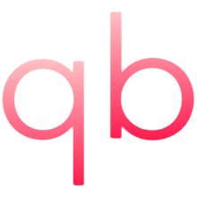
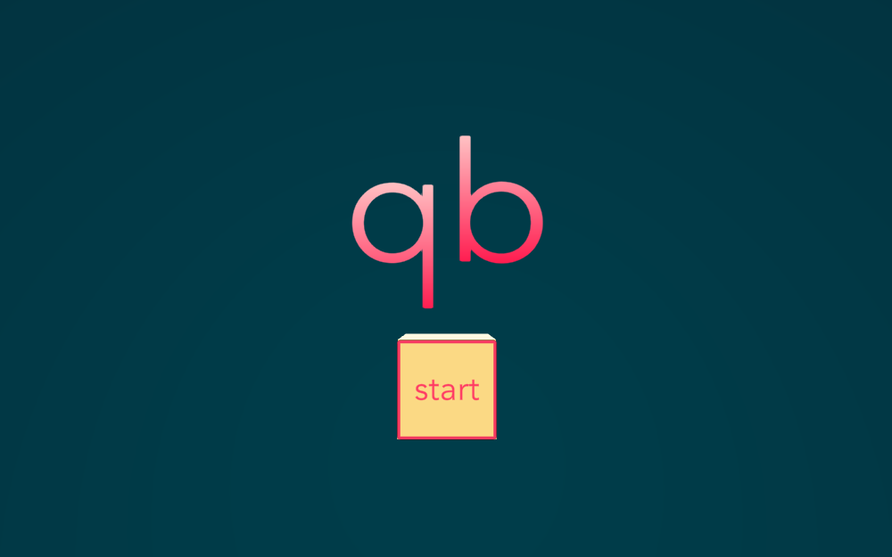
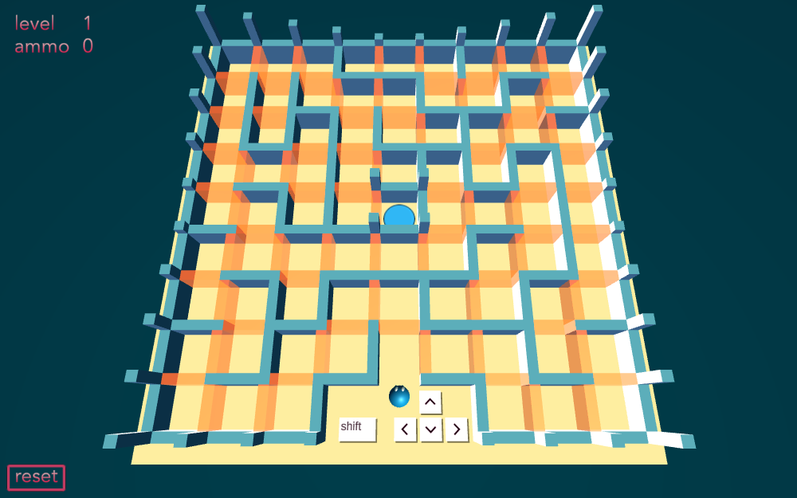
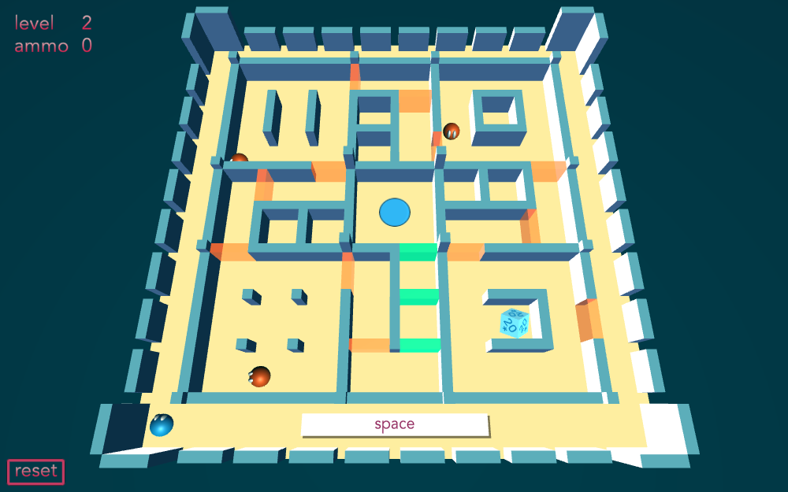
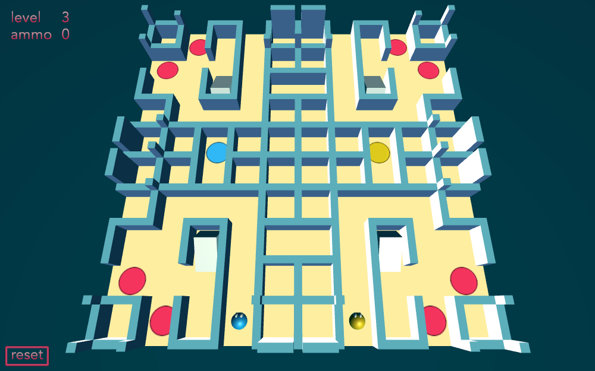
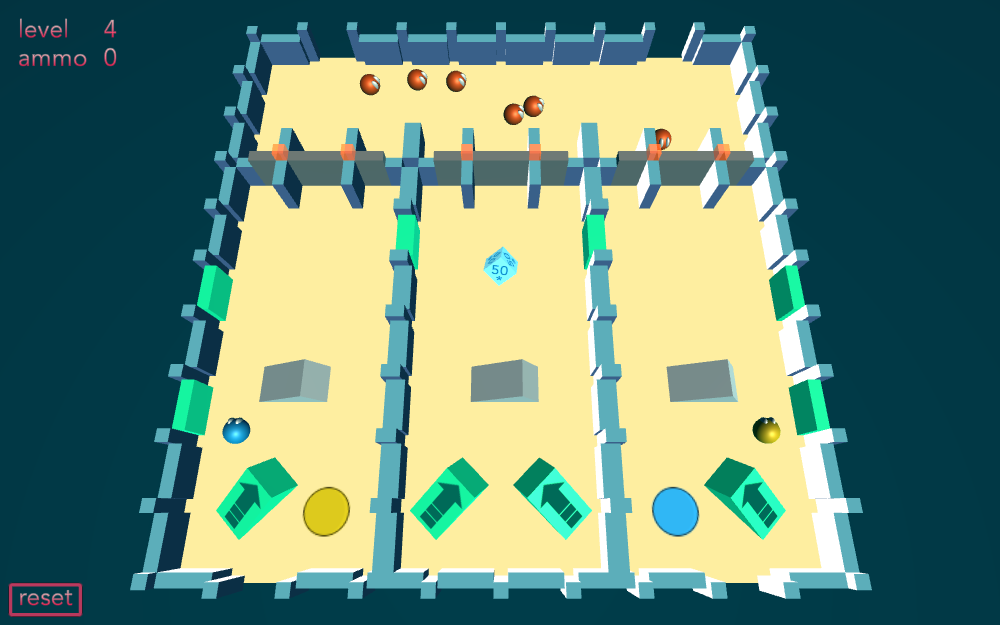
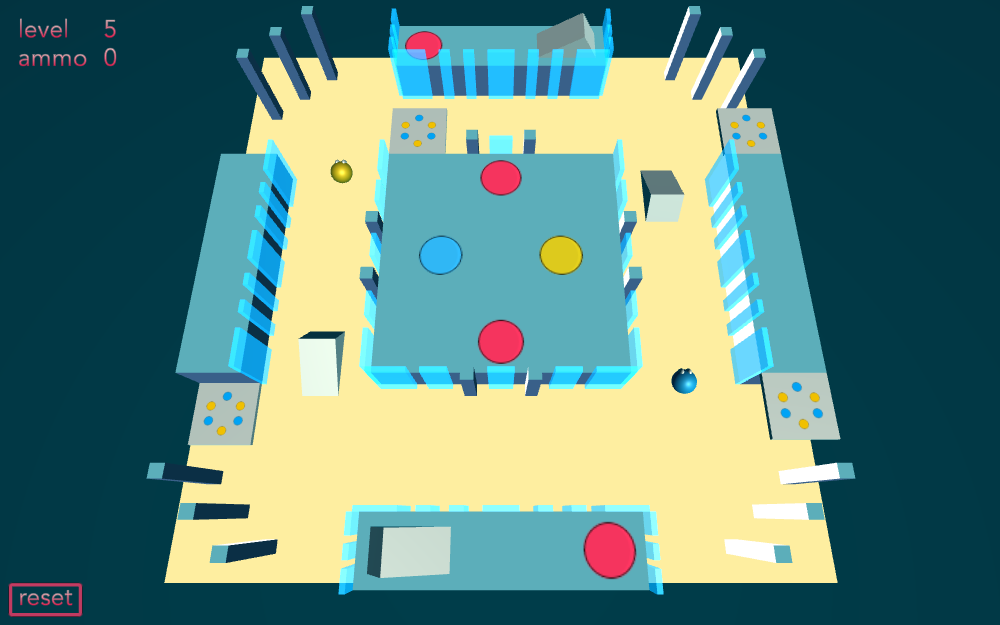
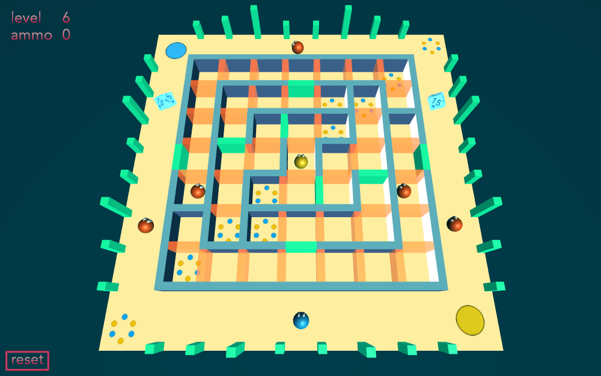

 

Welcome to `qb` ("cube"), a short and sweet 6-level puzzle game written in C# with Unity v2018.4. Thanks to the Unity ["Create With Code" team](https://learn.unity.com/course/create-with-code) for helping to kick-start this project. The game has been built to play in a web browser via WebGL, and a standard keyboard and mouse are required. Check out some videos on my [YouTube channel](https://www.youtube.com/channel/UC0N-pEu5wcB38418Xdms7cA). Can you beat the cube? Enjoy!

  
  

  

  

---

## Running live

A live version of this game can be found [here](https://play.unity.com/mg/other/qb-srnpls). You only need an up-to-date web browser in order to play, no special software is needed.

---

## Running locally

- Download the `Build/qb.zip` file, and unzip it
- Navigate to the `qb` directory in the terminal
- Start a local web server in that directory, such as via node.js (faster running):
    - `$ http-server -p 8080`
- Or via Python (slower running):
    - `$ python -m http.server --cgi 8080`
- In your web browser, go to `http://127.0.0.1:8080`. You should see the startup screen and now be able to play.
<!-- - Other than the regular play controls, which are presented in the game, in this development version you can force-clear a level by pressing `c`, or force-fail a level (i.e. reset) by pressing `f` -->
- When finished, go back to the terminal and press `Ctrl-c` to stop the local web server

---

## Assets

Design & Code &#169; 2020 [Darren Temple](https://github.com/Reikyo) 
All other assets are the property of their respective creators, and are used with thanks.

### Shader & Materials:
- Scrollbie Studio
    - https://assetstore.unity.com/publishers/29536
    - https://assetstore.unity.com/packages/vfx/shaders/minimalist-free-lowpoly-flat-gradient-shader-96148

### Visual Effects:
- JMO Assets
    - https://assetstore.unity.com/publishers/1669
    - https://assetstore.unity.com/packages/vfx/particles/cartoon-fx-free-109565
- Synty Studios
    - https://assetstore.unity.com/publishers/5217
    - https://assetstore.unity.com/packages/vfx/particles/simple-fx-cartoon-particles-67834

### Sound Effects:
- Dustyroom
    - https://assetstore.unity.com/publishers/16150
    - https://assetstore.unity.com/packages/audio/sound-fx/free-casual-game-sfx-pack-54116

### Music:
- Neocrey
    - https://assetstore.unity.com/publishers/29937
    - https://assetstore.unity.com/packages/audio/music/electronic/free-music-bundle-by-neocrey-92835
